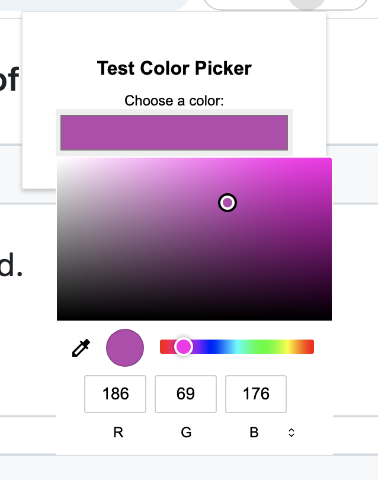
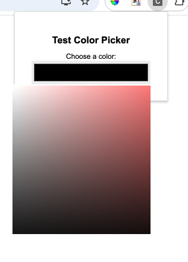

# Chrome extension external monitor bug
* When using a Chrome extension on an external monitor on a Mac, color pickers are zoomed in and consequently am unable to select a color.

## Working:

## Not working:

## Findings:
* If the external display is set as the 'Main display' in the Mac settings the issue disappears.
* If you open popup.html in a new tab (e.g. chrome-extension://xxxxxxx/src/popup.html) the issue disappears.
* If you use a separate web browser (e.g. Vivaldi) the issue disappears.

